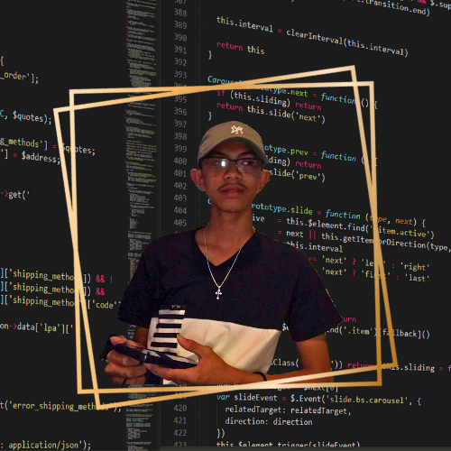
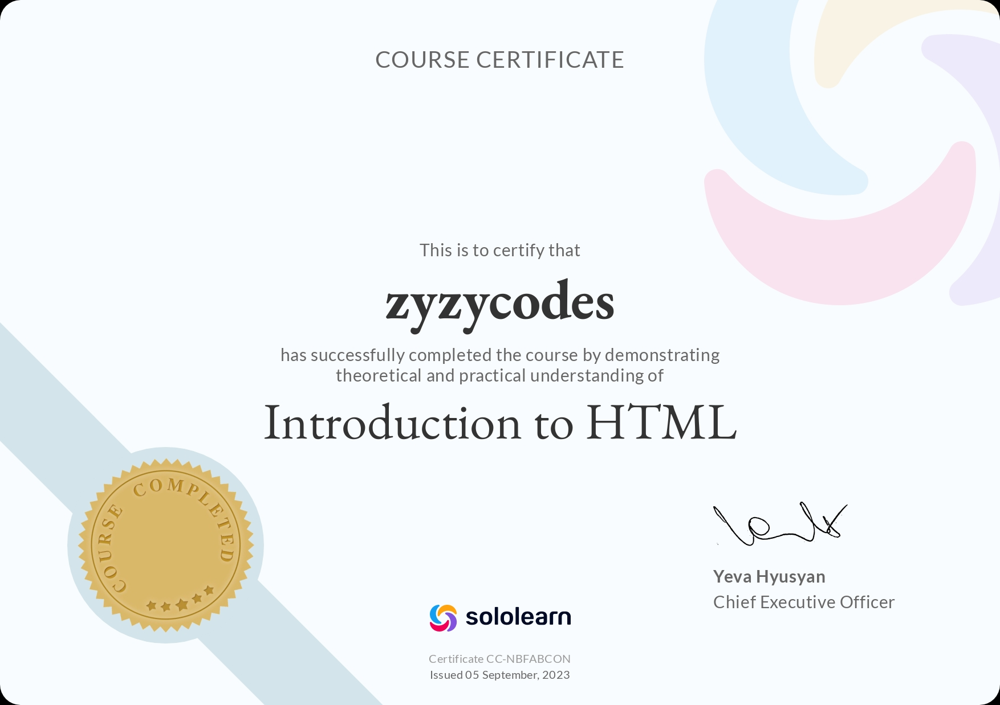

<!DOCTYPE html>
<html>
  <head>
    <meta name=”viewport” content=”width=device-width, initial-scale=1.0″>
    <title>myportfolio</title>
  </head>
  <body>
    <b>
ASPIRING FRONT-END DEVELOPER/SOFTWARE ENGINEER
</b> 
    

      
      <h3>Hello World! I'm Zyrus Espadilla</h3> 
      <h4 style="text-align:left" id="about">About me!</h4>
      
I'm a 15 year old G10 enthusiast with an interest for web development and software engineering. Learning to code is one of my passions, and I'm dedicated to continues growth and improvement in this field.
 
      <h4 style="text-align:left" id="skills">Skills & Course Certificates:</h4>
      
      
      
      
I hereby declare that all the skills and certificates that i've shown is true and valid to the best of my knowledge.

    

    <footer>
      <nav>
        <nav>
  <ul>
    <li><a href="#about">About me</a></li>
    <li><a href="#skills">certificates</a></li>
  </ul>
</nav>
    </footer>
  </body>
  
</html>
